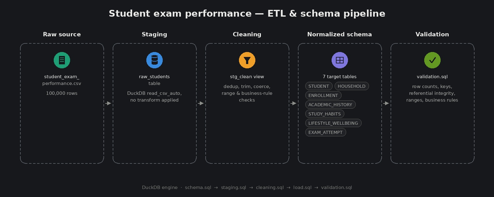
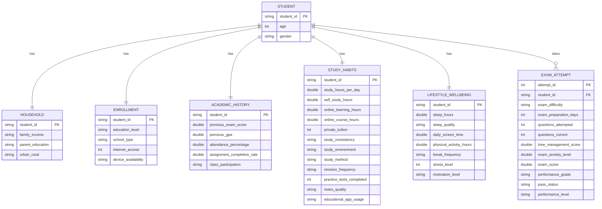

# Student Exam Performance: Data Modeling and Schema Normalization

## Overview

This project applies relational data modeling and normalization principles to a flat, denormalized dataset of 100,000 student records. The raw dataset combines demographic information, household background, study habits, lifestyle factors, and exam outcomes into a single wide table. This project decomposes that table into a normalized relational schema, builds an Entity Relationship Diagram (ERD), and implements a SQL based ETL pipeline that cleans and loads the raw data into the new schema.



## Dataset

Source file: `student_exam_performance.csv` [Link to dataset](https://www.kaggle.com/datasets/mobeenfatimah/student-exam-performance-and-success-dataset)

Rows: 100,000
Grain: one row per student per exam attempt

The raw file mixes several unrelated concerns in a single table: student demographics, household background, enrollment details, prior academic history, study habits, lifestyle and wellbeing indicators, and exam results. This mixing of concerns is the primary motivation for normalization.

## Data Modeling Principles Applied

### Functional Dependency Analysis

Every column in the raw dataset was evaluated for what it actually depends on. Columns that depend on the same determinant were grouped into the same entity. For example, `sleep_hours`, `sleep_quality`, and `stress_level` all depend on the student as a person, not on any exam event, so they belong together in a `LIFESTYLE_WELLBEING` entity rather than in the exam record.

### Normal Forms

**First Normal Form (1NF)**: The source data already satisfies 1NF. All values are atomic and there are no repeating groups within a row.

**Second Normal Form (2NF)**: All primary keys used in this schema are single column keys, so partial dependency does not apply. This was verified explicitly rather than assumed.

**Third Normal Form (3NF)**: Non key attributes must depend only on the key, not on other non key attributes. This principle was applied directly to the `EXAM_ATTEMPT` entity.

### Transitive Dependency

A transitive dependency exists when `A determines B` and `B determines C`, meaning `C` depends on `A` only indirectly through `B`. In this dataset, `exam_score` determines `performance_grade`, `pass_status`, and `performance_level`. These three columns do not depend on `attempt_id` directly; they depend on `exam_score`, which itself depends on `attempt_id`. This is a textbook transitive dependency and was documented as a deliberate design decision: the columns were retained as derived, denormalized fields for query convenience rather than extracted into a separate grading scale table, since the values are cheap to compute and frequently queried together.

### Entity Relationship Diagram



GitHub renders this diagram automatically when viewing this file in the repository, since Mermaid is natively supported in GitHub flavored markdown.

### Entity Relationship Modeling

The schema was modeled as seven entities:

* `STUDENT`: core demographic entity
* `HOUSEHOLD`: family income, parental education, urban or rural setting
* `ENROLLMENT`: education level, school type, device and internet access
* `ACADEMIC_HISTORY`: prior performance metrics
* `STUDY_HABITS`: study time, method, consistency, and preparation behavior
* `LIFESTYLE_WELLBEING`: sleep, stress, screen time, and motivation
* `EXAM_ATTEMPT`: the fact table representing a single exam event and its outcome

### Keys

**Primary key**: `student_id` uniquely identifies a student and is used as the primary key in `STUDENT` and, since the current relationships are one to one, as the primary key in `HOUSEHOLD`, `ENROLLMENT`, `ACADEMIC_HISTORY`, `STUDY_HABITS`, and `LIFESTYLE_WELLBEING` as well.

**Foreign key**: every child table references `STUDENT(student_id)` to enforce referential integrity.

**Surrogate key**: `attempt_id` was introduced in `EXAM_ATTEMPT` instead of reusing `student_id`, because this is the one entity in the schema with genuine one to many potential. A student may take more than one exam, so a natural key was not sufficient.

### Cardinality

* One to one: `STUDENT` to `HOUSEHOLD`, `ENROLLMENT`, `ACADEMIC_HISTORY`, `STUDY_HABITS`, `LIFESTYLE_WELLBEING`
* One to many: `STUDENT` to `EXAM_ATTEMPT`

### Vertical Partitioning versus Repeating Group Normalization

Most of the splits in this schema are one to one with `STUDENT`, meaning they represent vertical partitioning of a wide table by subject area rather than normalization driven by repeating groups. The one exception is `EXAM_ATTEMPT`, which is a true one to many relationship and is the only entity where classic normalization logic (introducing a surrogate key to support repeating rows) was required.

## ETL Pipeline

The pipeline follows a staging, cleaning, and load pattern, which mirrors the ELT approach used in modern data warehouses and tools such as dbt.

### Pipeline Stages

1. **Staging** (`staging.sql`): the raw CSV is loaded as is into a `raw_students` table using DuckDB's `read_csv_auto`, with no transformation applied. This preserves an auditable copy of the original data before any cleaning occurs.

2. **Schema definition** (`schema.sql`): the seven normalized target tables are created with explicit primary key and foreign key constraints, plus column level `CHECK` constraints where applicable.

3. **Cleaning** (`cleaning.sql`): a single view, `stg_clean`, centralizes every cleaning rule so that all downstream inserts read from one consistent, validated source instead of repeating logic per table.

4. **Load** (`load.sql`): each of the seven target tables is populated with `INSERT INTO ... SELECT` statements against `stg_clean`.

5. **Validation** (`validation.sql`): All validation queries are consolidated in `validation.sql`. Runs data quality checks against the loaded tables.

### Cleaning Rules Implemented

* **Deduplication**: `ROW_NUMBER()` partitioned by `student_id` removes duplicate student records, keeping the first occurrence.
* **Key validation**: `student_id` values that do not match the expected `STU_######` pattern are excluded, since a malformed key cannot be joined across tables.
* **Whitespace and blank normalization**: text fields are trimmed, and empty strings are converted to `NULL` using `NULLIF`.
* **Categorical standardization**: every categorical column is matched case insensitively against its known set of valid values using `CASE` expressions. Any value that does not match a known category becomes `NULL` rather than being silently accepted as free text.
* **Type coercion**: `TRY_CAST` is used instead of `CAST` so that a value which cannot be converted to the target type becomes `NULL` instead of causing the entire pipeline to fail.
* **Range validation**: numeric columns are checked against realistic bounds (for example, `previous_gpa` between 0 and 4.0, `stress_level` between 1 and 10). Values outside these bounds are set to `NULL` rather than clipped, so that impossible values do not silently become valid but incorrect ones.
* **Cross field validation**: `questions_correct` cannot exceed `questions_attempted`. Rows that violate this business rule have both fields nulled rather than being allowed to persist an internally inconsistent record.

## Repository Structure

```
staging.sql       Loads the raw CSV into a staging table
schema.sql        Defines the normalized target tables and constraints
cleaning.sql      Defines the stg_clean view containing all cleaning logic
load.sql          Inserts cleaned data from stg_clean into the target tables
validation.sql    Runs data quality checks against the loaded tables
```

## Execution Order

Run the scripts in the following sequence against a DuckDB database:

1. `schema.sql`
2. `staging.sql`
3. `cleaning.sql`
4. `load.sql`
5. `validation.sql`

Note: the `DROP TABLE raw_students` statement should be executed only after `load.sql` has completed, since `cleaning.sql` depends on `raw_students` still existing. If running the scripts as separate files in sequence, move the drop statement to run last rather than immediately after the table is created.

## Data Quality Validation

All validation queries are consolidated in `validation.sql`. They should be run after `load.sql` completes and before `raw_students` is dropped. Each query is designed so that an empty result set (or a result set matching only the documented allowed values) means the check passed.

### Row Count Check

Confirms no rows were unexpectedly lost or duplicated during cleaning and load.

```sql
SELECT
    (SELECT COUNT(*) FROM raw_students)          AS raw_row_count,
    (SELECT COUNT(*) FROM STUDENT)                AS student_row_count,
    (SELECT COUNT(*) FROM EXAM_ATTEMPT)            AS exam_attempt_row_count;
```

### Duplicate Key Check

Should return zero rows. Any row here means deduplication in `cleaning.sql` failed.

```sql
SELECT student_id, COUNT(*) AS occurrences
FROM STUDENT
GROUP BY student_id
HAVING COUNT(*) > 1;
```

### Referential Integrity Check

Should return zero rows. Any row means a child table has a foreign key that does not exist in `STUDENT`. Repeated for `HOUSEHOLD`, `ENROLLMENT`, `ACADEMIC_HISTORY`, `STUDY_HABITS`, `LIFESTYLE_WELLBEING`, and `EXAM_ATTEMPT`.

```sql
SELECT ea.student_id FROM EXAM_ATTEMPT ea
LEFT JOIN STUDENT s ON s.student_id = ea.student_id
WHERE s.student_id IS NULL;
```

### Categorical Value Check

Each result set should only contain the documented allowed values, plus `NULL`.

```sql
SELECT DISTINCT exam_difficulty, performance_grade, pass_status, performance_level
FROM EXAM_ATTEMPT;
```

### Numeric Range Check

Should return zero rows. Any row means an out of range value slipped past the cleaning logic.

```sql
SELECT * FROM ACADEMIC_HISTORY
WHERE previous_exam_score NOT BETWEEN 0 AND 100
   OR previous_gpa NOT BETWEEN 0 AND 4.0
   OR attendance_percentage NOT BETWEEN 0 AND 100
   OR assignment_completion_rate NOT BETWEEN 0 AND 100;
```

### Boolean Flag Check

Should return zero rows. Confirms `private_tuition` and `internet_access` only ever contain 0 or 1.

```sql
SELECT * FROM STUDY_HABITS WHERE private_tuition NOT IN (0, 1);
SELECT * FROM ENROLLMENT WHERE internet_access NOT IN (0, 1);
```

### Cross Field Business Rule Check

Should return zero rows. A student cannot answer more questions correctly than the number of questions they attempted.

```sql
SELECT * FROM EXAM_ATTEMPT
WHERE questions_correct > questions_attempted;
```

### Student ID Format Check

Should return zero rows. Confirms every key matches the expected `STU_######` pattern.

```sql
SELECT student_id FROM STUDENT
WHERE student_id !~ '^STU_\d{6}$';
```

### Spot Check Sample

Pulls a small random sample joined across tables for manual review against the original raw CSV.

```sql
SELECT s.student_id, s.age, s.gender, h.family_income, sh.study_hours_per_day,
       ea.exam_score, ea.pass_status
FROM STUDENT s
JOIN HOUSEHOLD h ON h.student_id = s.student_id
JOIN STUDY_HABITS sh ON sh.student_id = s.student_id
JOIN EXAM_ATTEMPT ea ON ea.student_id = s.student_id
USING SAMPLE 10 ROWS;
```

## Tools Used

* DuckDB as the SQL engine, chosen for its ability to query CSV files directly with `read_csv_auto`
* Standard SQL for all transformation logic, including window functions, `CASE` expressions, and `TRY_CAST`

Made by Rui Manalo · [LinkedIn](https://www.linkedin.com/in/rui-manalo-71350a376), [Portfolio](https://www.datascienceportfol.io/ruicourse3)
